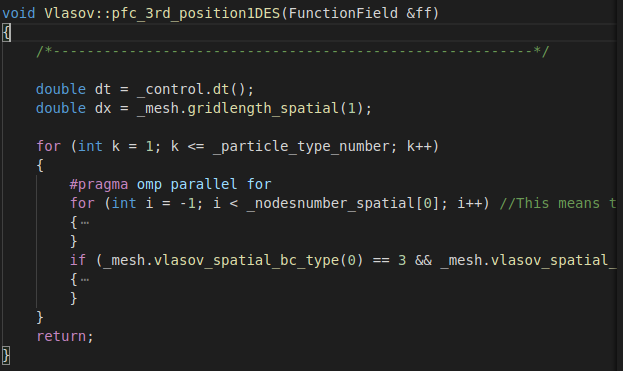
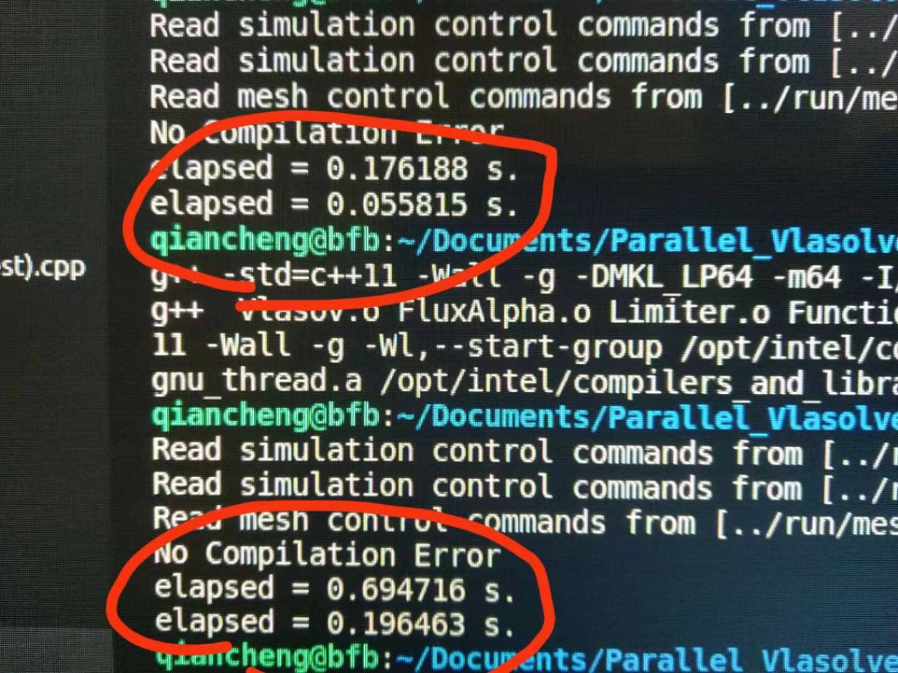
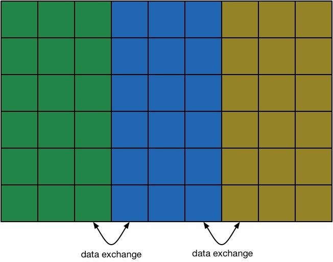
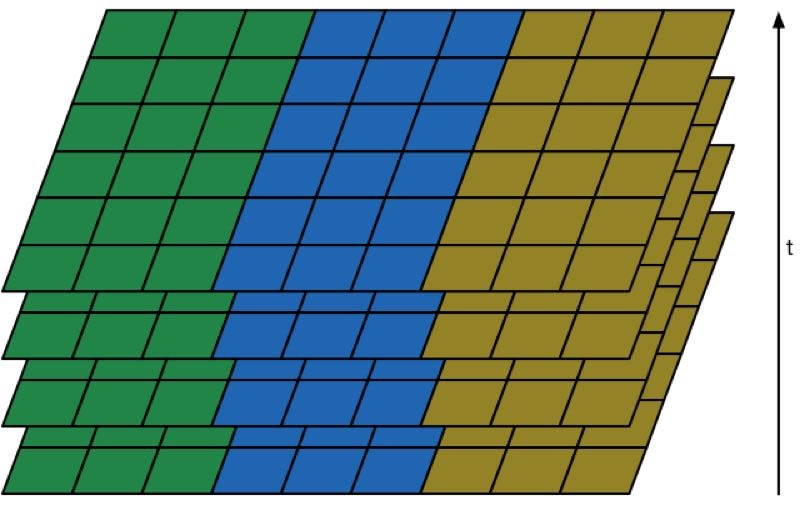
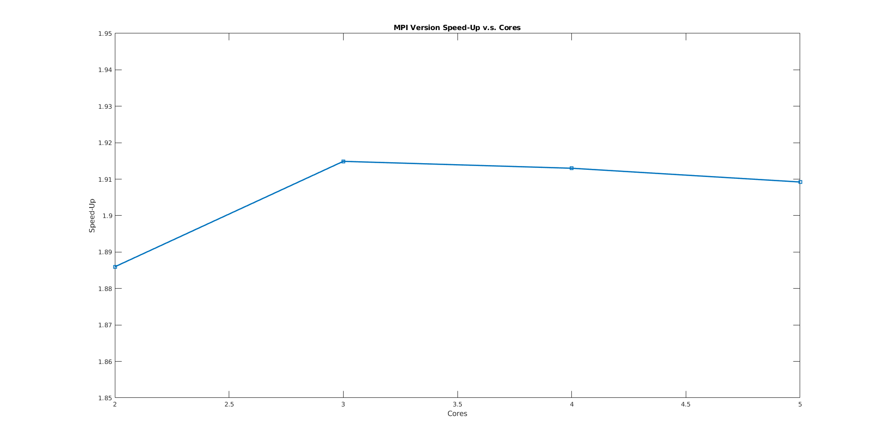

# **ParaVlasolver: Parallel Grid-Based Kinetic Vlasov Solver**

A Parallel High-Performance Grid-Based Kinetic 1D1V Vlasov Solver for Computational Plasma Dynamics. This readme file serves to show the proposal and some of the preliminary results for this solver. 

## **Outline and Preliminary Results**

### 1. **Author and Maintainer**
* Chen Cui (cuichen@usc.edu) 
* Qiancheng Zhao (qianchez@usc.edu)

### 2. **Problem Description**

**Physical Processes Need to be Studied in the Plasma Flow of Electric Propulsion Thrusters**
* Electrons in plasma expansion problems are proven to be non-equilibrium, fluid desscription is not valid anymore.
* Electrons' temperature is proven to be anisotropic, thermodynamics and energy transfer process need to be studied.
* Kinetic Method need to be used instead of fluid method to resolve physical processes.

*Ion Thruster*

*Comparison Between Full and Hybrid PIC[6-7]*

**Low Noise Method is Needed to Resolve Physical Processes**
* Numerical noise will combine with physical processes and make the physical processes hard to be studied.
* Particle-based kinetic method is easy to be implemented but with big numerical noise. Grid-based kinetic method have no-inherent numerical noise but with huge computational cost.
* Parallel grid-based kinetic method need to be developed.

### 3. **Methods and Techniques**
**Algorithms**
* Semi-Lagrangian time stepping.
* Third Order Positive Flux Conservation [1] method on phase domain discretization. 

*Semi-Lagrangian Method*

**Parallelization**
* Thread Parallelization: ***OpenMP***
* Domain Decomposition: ***OpenMPI***
* Inhomogeneous Parallelization: ***CUDA[2]***

### 4. **Expected Results**
* Improve the computational efficency of the original ***Vlasolver***
* Keep the possiblity of achieving higher dimensional ***Vlasolver***

### 5. **Some Physical Results from Sequential Code [3-5]**
**Simulation Set-up**

*Plasma Injection Scheme*

*Initial Distribution Function*

**Verification and Validation**
* Two-Stream Instaibility
  
  

* Landau Damping
  

**1-D Plasma Jet Expansion**
* Density Evolution
    

* Potential Evolution
    

* Self-Similar Theory
    

### 6. **Preliminary Results on Parallel Implementation**
**Sequential Code Structure**

The sequential code is a fully object-oriented code written in C++. Different functions of the solver are implemented in different modules(or more strictly speaking, class). 

Module List:
  * Control Module (Control.h & Control.cpp), used for reading in the control information for the solver. Constructing other classes
  * Mesh Module (Mesh.h & Mesh.cpp), used for constructing the mesh for solver. Currently we only support the rectangular and structure mesh.
  * Container Module (xxField.h xxField.cpp), reloaded containers for datas. Developed for containing scalar data such like $\phi$ and vector datas such like $\vec{E}$ and distribution functions $f$. These container classes had been reloaded so that the data index will be naturally expressed and thus the index like $-1$ and $N+1$ which is above the index range can be directly used to index the data and thus the ghost cells can be introduced and will make it convenient for the furture design of the domain decomposed MPI parallelization. The flux and limiter will also be contained in similar data structures as talked above.
  * Poisson Module (Poisson.h Poisson.cpp), this module is a solver for the elliptical partial differential equation, namely Poisson equation. The equation will be discretized by using the finite difference method. Then the stiffness matrix will be constructed with in this class and then this problem will be transfered into a linear algebra problem $Ax=B$. This class introduces an interface to the high-perfomrance linear algebra library eigen and Intel Math Kernel Library & Paradiso. 
  * Vlasov Module (Vlasov.h & Vlasov.cpp), this part is the heaviest computational cost region. The main calculations of the solvers will be performed here. Currently the calculations performed here are not vectorized. In the future the calculations performed here will be improved and written into vectorized form. A finite volume like method is used here and the flux and limiters will be calculated and stored in the containers.

**OpenMP Implementation**

The first step for implementing a parallel code is to use multi-thread method to speed-up the code. Openmp is selected to be used. Since our code is a Eulerian grid based code, the computational heavy part will be consisted of several huge loops. Thus the multi-thread method can definitely improve the performance.

  

*OpenMP Implementation*

  

*A simple test on running speed of executing a single loop. Up is the parallelized code and below is the sequential code, all without compiler optimization*

With the Intel/GNU C/C++ Compiler and the highest optimization without losing of safety, the openmp optimized code can run around 5 times quicker than the serial code on a laptop with 6 cores. 

**MPI Implementation**

After using the multi-thread parallel computing techniques, the domain decomposation techniques can be utilized to the code to futher enable its working efficency on clusters with multiple nodes. This can be done by the MPI interface. We are still in the process of working on the MPI part. The basic idea we had now is decompose the domain along the spatial domain axis. Then each sub-domain change information with its neighbor after each computational step. The idea can be shown as below.

 

 

*Domain Decomposition*

**GPU Computing Implementation**

CUDA library can be used in this part. We did not touch in too much details of this part in this time's work. However we do have a simpier version of GPU computing of vlasov solver and based on our test the performance was not increased too much by using GPU. One major problem is the communication elapse. However if the Vlasov module can be vectorized then the calculations can be fairly quick on the GPU which is designed for matrix calculations. We will touch this in the future.

### 7. **Current State and Future Endeavors**

* We are now optimizing the sequential code and at the same time doing domain decompositions by using MPI.
* Future the GPU computing will be implemented into this parallel code. 

## **Reference**
[1]: Filbet, F., Sonnendrücker, E. and Bertrand, P., 2001. Conservative numerical schemes for the Vlasov equation. Journal of Computational Physics, 172(1), pp.166-187.

[2]: Einkemmer, L., 2019. Semi-Lagrangian Vlasov simulation on GPUs. arXiv preprint arXiv:1907.08316.

[3]: Cui, C., Hu, Y. and Wang, J., 2019. Direct Grid-Based Vlasov Simulation of Collisionless Plasma Expansion of Ion Thruster Plume. In AIAA Propulsion and Energy 2019 Forum (p. 3992).

[4]: Cui, C., Huang, Z., Hu, Y. and Wang, J., 2019. Grid-Based Kinetic Simulations of Collisionless Plasma Expansion. In the 36th International Electric Propulsion Conference (2019).

[5]: Cui, C., Hu, Y. and Wang, J., 2019. On-going projects on Vlasov Simulations of Thermodynamics of Plasma Plume Expansion.

[6]: Wang, J. and Hu, Y., 2019. On the limitations of hybrid particle-in-cell for ion thruster plume simulations. Physics of Plasmas, 26(10), p.103502.

[7]: Hu, Y. and Wang, J., 2018. Expansion of a collisionless hypersonic plasma plume into a vacuum. Physical Review E, 98(2), p.023204.