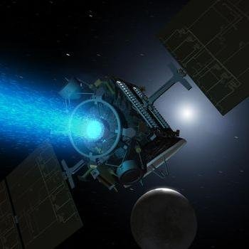
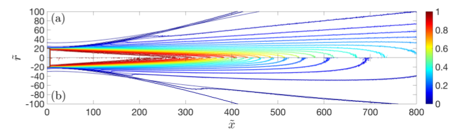
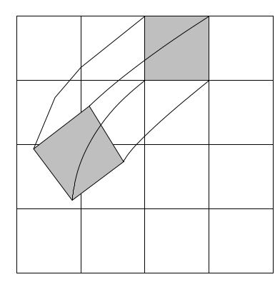
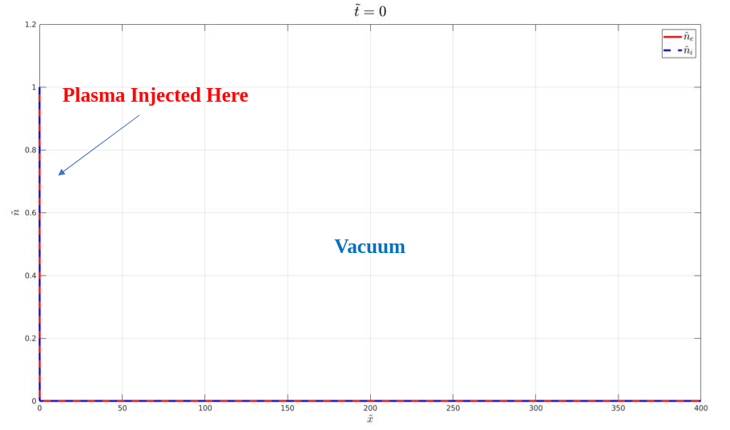
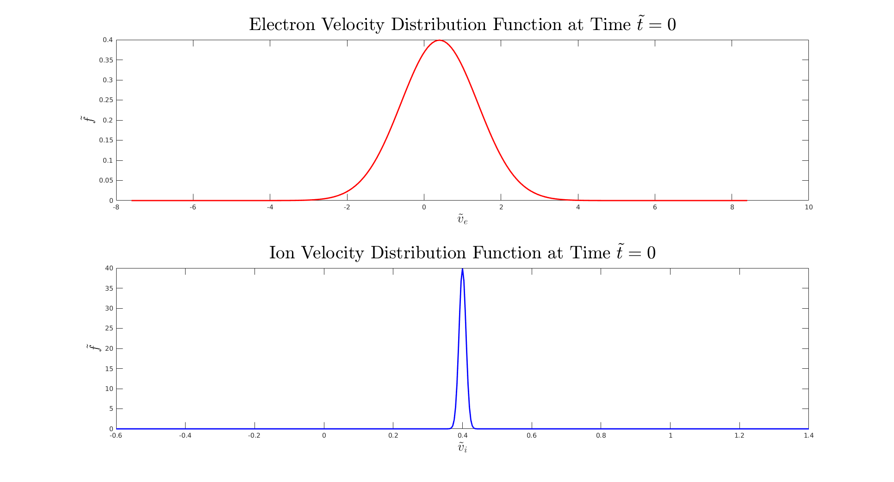
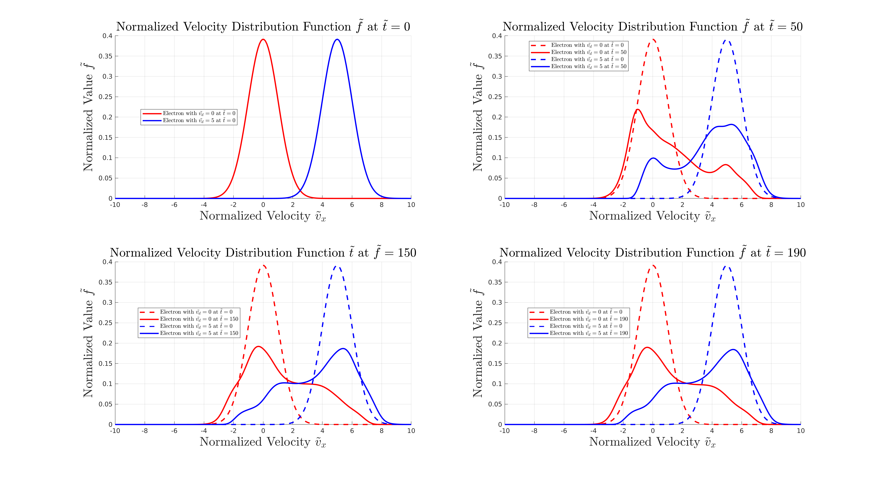
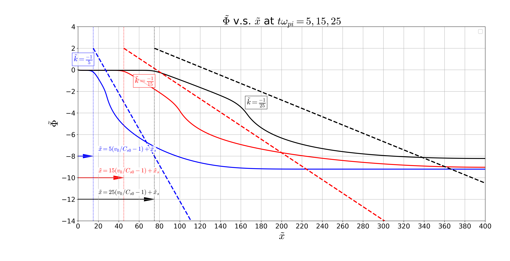

# **ParaVlasolver: Parallel Grid-Based Kinetic Vlasov Solver**

A Parallel High-Performance Grid-Based Kinetic 1D1V Vlasov Solver for Computational Plasma Dynamics

## **Outline**

### 1. **Author and Maintainer**
* Chen Cui (cuichen@usc.edu) 
* Qiancheng Zhao (qianchez@usc.edu)

### 2. **Problem Description**

**Physical Processes Need to be Studied in the Plasma Flow of Electric Propulsion Thrusters**
* Electrons in plasma expansion problems are proven to be non-equilibrium, fluid desscription is not valid anymore.
* Electrons' temperature is proven to be anisotropic, thermodynamics and energy transfer process need to be studied.
* Kinetic Method need to be used instead of fluid method to resolve physical processes.

*Ion Thruster*

*Comparison Between Full and Hybrid PIC[6-7]*

**Low Noise Method is Needed to Resolve Physical Processes**
* Numerical noise will combine with physical processes and make the physical processes hard to be studied.
* Particle-based kinetic method is easy to be implemented but with big numerical noise. Grid-based kinetic method have no-inherent numerical noise but with huge computational cost.
* Parallel grid-based kinetic method need to be developed.

### 3. **Methods and Techniques**
**Algorithms**
* Semi-Lagrangian time stepping.
* Third Order Positive Flux Conservation [1] method on phase domain discretization. 

*Semi-Lagrangian Method*

**Parallelization**
* Thread Parallelization: ***OpenMP***
* Domain Decomposition: ***OpenMPI***
* Inhomogeneous Parallelization: ***CUDA[2]***

### 4. **Expected Results**
* Improve the computational efficency of the original ***Vlasolver***
* Keep the possiblity of achieving higher dimensional ***Vlasolver***

### 5. **Some Physical Results from Sequential Code [3-5]**
**Simulation Set-up**

*Plasma Injection Scheme*

*Initial Distribution Function*

**Verification and Validation**
* Two-Stream Instaibility
  
  

* Landau Damping
  

**1-D Plasma Jet Expansion**
* Density Evolution
    

* Potential Evolution
    

* Self-Similar Theory
    

## **Reference**
[1]: Filbet, F., Sonnendrücker, E. and Bertrand, P., 2001. Conservative numerical schemes for the Vlasov equation. Journal of Computational Physics, 172(1), pp.166-187.

[2]: Einkemmer, L., 2019. Semi-Lagrangian Vlasov simulation on GPUs. arXiv preprint arXiv:1907.08316.

[3]: Cui, C., Hu, Y. and Wang, J., 2019. Direct Grid-Based Vlasov Simulation of Collisionless Plasma Expansion of Ion Thruster Plume. In AIAA Propulsion and Energy 2019 Forum (p. 3992).

[4]: Cui, C., Huang, Z., Hu, Y. and Wang, J., 2019. Grid-Based Kinetic Simulations of Collisionless Plasma Expansion. In the 36th International Electric Propulsion Conference (2019).

[5]: Cui, C., Hu, Y. and Wang, J., 2019. On-going projects on Vlasov Simulations of Thermodynamics of Plasma Plume Expansion.

[6]: Wang, J. and Hu, Y., 2019. On the limitations of hybrid particle-in-cell for ion thruster plume simulations. Physics of Plasmas, 26(10), p.103502.

[7]: Hu, Y. and Wang, J., 2018. Expansion of a collisionless hypersonic plasma plume into a vacuum. Physical Review E, 98(2), p.023204.