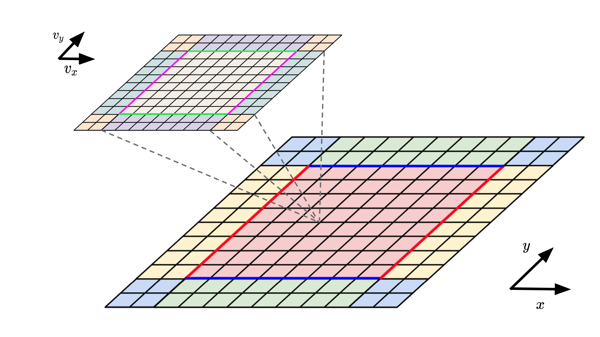
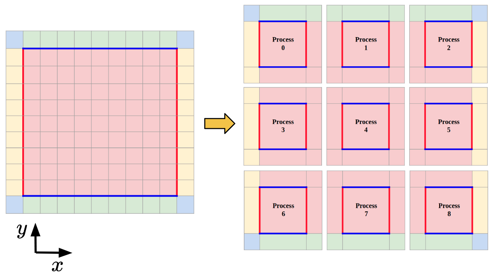
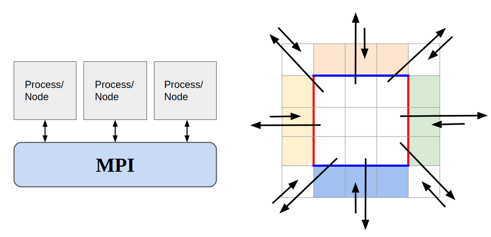
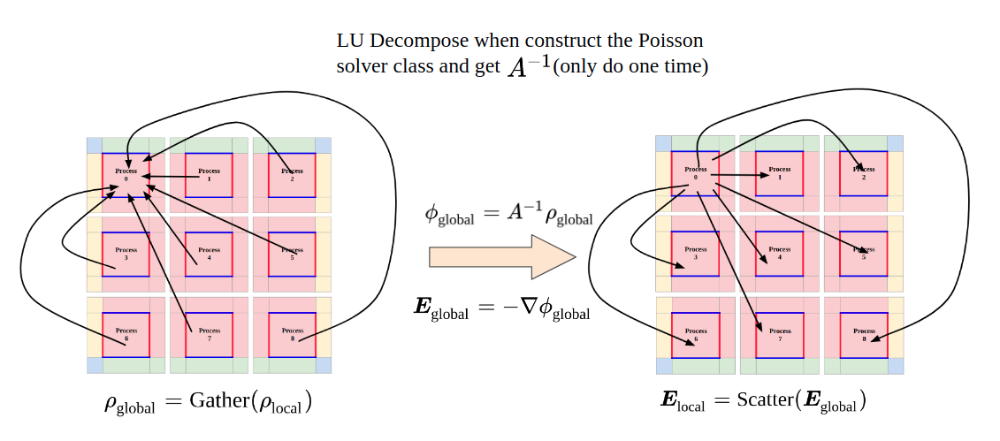

# **Vlasolver: Grid-Based Kinetic Vlasov Equation Solver**

A high-performance grid-based kinetic Vlasov solver for computational plasma dynamics, main application scopes focus on electric propulsion plasma simulation and space plasma turbulence/instabilities simulation and basic plasma dynamics. This readme file serves to show the outline and preliminary results for this project.

## 1. **Author, Contributor and Maintainer**
* **Author and Maintainer**
          
    Chen Cui (cuichen@usc.edu)

* **Contributor**  
    
    Qiancheng Zhao (qianchez@usc.edu)

## 2. **Models and Equations for Vlasolver**
The model used in this work is a Vlasov-Poisson system which is a kinetic description of the electrostatic collisionless plasma system(with or without the external B field). The Vlasov equation can be written as:

The acceleration term  is

if the external B field is included and

if the external B field is not included.

The  electric potential.  needs to be solved self-consistently  using the Poisson equation

 
The macroscopic properties of the plasma are described  by the moments  of the VDF

## 3. **Simulation Methods and Computing Algorithm**
The phase space(both physical and velocity space) will be discretized into computational mesh. The partial differential equations in the Vlasov-Poisson system will be solved directly on the mesh. While the Vlasov-Poisson system  is a non-linear system, the Vlasov equation itself is a first-order hyperbolic partial differential equation (PDE).  Many numerical schemes have been developed to  solve hyperbolic PDEs.

The methods below are used to discretize the PDEs to numerically solve the Vlasov-Poisson system above.

* Operator Splitting.
* Semi-Lagrangian time stepping.
* Third Order Positive Flux Conservation[1] method on phase domain discretization. 

We use this term to describe the capability of handling the phase space dimensions: **xDyV** (x physical domain dimensions and y velocity domain dimensions). 

The code will solve the Vlasov-Poisson system in the following process [2]:

1. Solve the spatial advection equations 

&nbsp;&nbsp;&nbsp;&nbsp;&nbsp;&nbsp;for half the time step: 

2. Update the Poisson equation:

3. Solve the acceleration equations:

&nbsp;&nbsp;&nbsp;&nbsp;&nbsp;&nbsp;for the whole time step:

&nbsp;&nbsp;&nbsp;&nbsp;&nbsp;&nbsp;where the v star is the solution of the characteristics of the acceleration equations.

4. Solve the spatial advection equations 

&nbsp;&nbsp;&nbsp;&nbsp;&nbsp;&nbsp;for half the time step: 

## 4. **Current Capabilities of Phase Space Dimensions**

* **1D1V** (**Serial** and **Parallel**)
* **2D2V** (with or without external B field both supported, **Serial** and **Parallel**) 

>*Schematic Plot for 2D2V Vlasolver calculation domain*

## 5. **Code Structures**
The code adopts objective-oriented structure. And the classes(modules) can be categorized into several groups. 
1. Utilities:
   * Control class
   * Mesh class
   * ParallelControl class(If parallelization enabled, all of the MPI functions used in this code are wrapped here.)
   * LocalMesh class(If parallelization enabled)
2. Containers:
   * ScalarField class
   * VectorField class
   * FunctionField class
3. Poisson Solver:
   * Poisson class
4. Vlasov Solver:
   * Vlasov class
   * InitialFun class(For initial condition and boundary condition implementations)
5. Diagnostic:
   * Diagnostics class

## 6. **Parallelization**
Vlasolver is currently parallelized by doing domain decomposition  in physical domain. The physical domain is decomposed into local domains and assigned to the corresponding process. Informations are changed and stored in each local domain's guard cells. The velocity is not decomposed now and each process have a full set of velocity space. It is in the plan that in the future the shared-memory parallelization techniques or the heterogeneous computing techniques can be used to parallize the velocity space.

>*Schematic plot for the domain decomposition in physical space*

For the Vlasov equation solving module, the normal communication mode is used and each process send and receive information to/from their neighbors.

>*Schematic plot for the physical space communications*

For the Poisson solver, currently the code adopt the "Gather-and-Solve" mode. The global mesh information is used to construct the coefficient matrix for the Poisson solver at the initialization of the Poisson solver and the inverse matrix of this coefficient matrix is solved with the support of Eigen library and Intel Pardiso library. In each step, each process will calculate the local charge and these information will be gathered by the "solver" process, the "solver" process will then calculate the potential and E field based on this information and will broadcast the corresponding information for each processor. It is in the plan that in the future this code will support potential solver which solves the potential locally.

>*Schematic plot for the "Gather-and-Solve" scheme*

## 7. **Install Requirements**

1. Compiler: 
   * GNU <code>g++</code> compiler(>=5.4.0 and recommend 8.3.0) 
   * Intel <code>icpc</code> compiler(tested 2019 release and 2020 release)  
   * LLVM <code>clang++</code> compiler(>=11.0).

2. Parallel Environment:
   * MPI Library: <code>OpenMPI</code>(>=1.10) 

3. Necessary Math Library:
   * Intel <code>Math Kernel Library(MKL)</code>(>=2019 release)
   * <code>Eigen</code> linear algebra library(>=3.3.9) 

---
## **Reference**
[1] Filbet, F., Sonnendrücker, E. and Bertrand, P., 2001. Conservative numerical schemes for the Vlasov equation. Journal of Computational Physics, 172(1), pp.166-187.

[2] Cheng, C.Z. and Knorr, G., 1976. The integration of the Vlasov equation in configuration space. Journal of Computational Physics, 22(3), pp.330-351.
